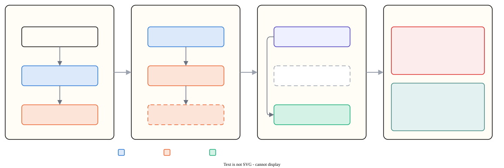
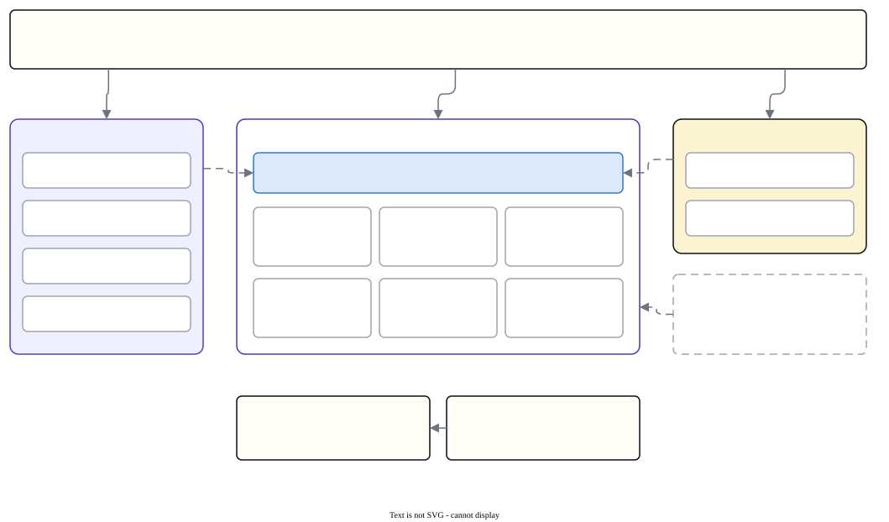

# treehawk

[](https://github.com/ibadrather/treehawk/actions/workflows/ci.yml)
[](https://github.com/ibadrather/treehawk/releases/latest)
[](https://github.com/ibadrather/treehawk/actions/workflows/ci.yml)
[](https://github.com/ibadrather/treehawk/actions/workflows/ci.yml)
[](https://github.com/ibadrather/treehawk/actions/workflows/ci.yml)
[](https://github.com/ibadrather/treehawk/actions/workflows/ci.yml)
[](https://github.com/ibadrather/treehawk/actions/workflows/ci.yml)
[](#)
[](#)
[](LICENSE)
[](https://ibadrather.github.io/treehawk/)

Log the CPU and RAM a process uses — **and every process it spawns**, including
children that daemonize and detach themselves.

**Documentation: <https://ibadrather.github.io/treehawk/>**

Point it at something already running, by keyword or by the exact command line:

```bash
treehawk watch train.py                       # substring of the command line
treehawk watch --exact "python train.py"      # the whole command line
treehawk watch --regex 'worker-\d+'
treehawk watch --pid 4213
```

…or let treehawk start the command, which is more accurate (see below):

```bash
treehawk run -- python train.py --epochs 10
```

Either way it keeps sampling until the workload ends — no duration to set, and
`Ctrl-C` or a shutdown `SIGTERM` still writes a complete summary. While it runs
you get a live dashboard; afterwards, read the log back:

```bash
treehawk report treehawk-20260913-100000.jsonl   # summary in the terminal
treehawk pdf    treehawk-20260913-100000.jsonl   # an 8-page PDF report
```

Linux and macOS, including Apple Silicon. Metrics come from the kernel
directly — `/proc` and cgroup v2 on Linux, `libproc` and `sysctl` on macOS —
not from `ps`, `top` or `pidstat`, and not from a third-party library. Typer
and Rich are used for the interface, matplotlib only when you ask for a PDF.
The two platforms differ in what the kernel will tell you; [what works where
is spelled out below](#platform-support).

## Install

```bash
curl -LsSf https://github.com/ibadrather/treehawk/releases/latest/download/install.sh | sh
```

The script installs the `treehawk` command from the latest GitHub release with
`uv tool install` (or `pipx`, if that is what you have). If neither is present
it installs uv first, and uv fetches a suitable Python by itself. Pin a version
with `| sh -s -- --version 0.4.0`; `--help` lists the rest.

Or install a release yourself (Linux or macOS, Python 3.10+):

```bash
uv tool install https://github.com/ibadrather/treehawk/releases/download/v0.4.0/treehawk-0.4.0-py3-none-any.whl
uv tool install git+https://github.com/ibadrather/treehawk   # latest main
```

From a checkout:

```bash
uv sync            # or: pip install -e .
uv run treehawk --help
```

## The problem it solves

Monitoring "a process and its children" by walking parent-child links works
right up until a child daemonizes — `fork`, `setsid`, `fork` again, original
parent exits. The survivor is re-parented to PID 1 (or to a subreaper such as
`systemd --user`) and has left its parent's session. A moment later there is no
link left to follow, and a naive monitor reports that the workload finished
while it is still burning a core.

<picture>
  <source media="(prefers-color-scheme: dark)" srcset="docs/assets/diagrams/daemonize.dark.svg">
  
</picture>

treehawk keeps membership by four independent rules and *never evicts* a
process once admitted — it stays tracked until that exact process exits, no
matter what its parent becomes:

| rule | catches |
|---|---|
| `tree` | ordinary children and grandchildren |
| `cgroup` | anything inside a kernel boundary the workload owns — the one thing a fork cannot escape |
| `session` | children re-parented away that kept the session |
| `orphan` | a process that appeared during the watch, lost its parent, and sits in a tracked process' boundary |

Choose them with `--expand tree --expand cgroup --expand orphan` (all four are on
by default).

The boundary the `cgroup` rule follows is a **cgroup** on Linux and a
**coalition** on macOS — the rule keeps its Linux name, and so does the `via`
value in the log. They are the same idea: a process that forks, calls
`setsid`, forks again and is re-parented to init keeps the one it started in,
while unrelated programs sit in their own.

The `orphan` rule is the one that closes the daemonization gap in attach mode.
It recognises re-parenting by noticing that the adopting reaper lives in a
*different* boundary, which is what separates a detached grandchild from an
unrelated process started in the same terminal.

### `run` is exact; `watch` is very good

`treehawk run` starts the command inside its own transient cgroup
(`systemd-run --user --scope`). Membership is then a kernel fact rather than an
inference, CPU and memory totals come from `cpu.stat` and `memory.current`, and
nothing is missed before the first sample — including processes that are born
and die between two samples. If systemd is unavailable treehawk falls back to
`/proc` tracking and says so in the log header.

On macOS, `run` still starts the command and still misses nothing before the
first sample, but it cannot create a boundary: placing a process in a new
coalition needs entitlements treehawk does not have. Membership is inferred
there in both modes, and the log header says so.

`treehawk watch` has to infer membership. It is reliable in practice, but a
process that detaches *and* moves itself to an unrelated boundary in the gap
between two samples can be missed. Use `run` when exactness matters.

## Output

JSON Lines by default: a `header` record, one `sample` per interval, and a
`summary` at the end. Records are flushed as they are written, so a killed run
still leaves a readable log.

```jsonc
{"type":"sample","seq":12,"t":6.0,"ts":"...","n_procs":3,
 "cpu_percent":287.4,          // sum across processes; 100% = one core
 "cpu_percent_norm":9.0,       // of the whole machine
 "cpu_seconds_total":18.4,     // lifetime cpu time, incl. exited children
 "cpu_seconds_used":17.9,      // ...since treehawk attached
 "rss_bytes":1379926016,       // sum of RSS: double-counts shared pages
 "pss_bytes":1104150528,       // shared pages divided fairly - the honest number
 "swap_bytes":0,
 "group_memory_bytes":1107296256,      // the kernel's own figure, when available
 "group_memory_peak_bytes":1342177280,
 "overrun":false,
 "procs":[{"pid":9001,"ppid":1,"name":"python","cmdline":"python train.py",
           "cpu_percent":99.8,"rss_bytes":...,"pss_bytes":...,"via":"orphan"}]}
```

`via` says which rule found each process — useful when a result surprises you.

`--csv` writes `run.csv` (one row per sample) and `run.procs.csv` (one
row per process per sample, joinable on `seq`), with the header and summary
alongside as JSON.

### Which memory number to trust

Three are recorded because each is wrong in a different way:

* **`rss_bytes`** — always available, but summing RSS over a fork tree counts
  every shared page once per child. Overstates real use, sometimes by a lot.
* **`pss_bytes`** — the platform's fair measure: what the workload really costs
  the machine. Disable with `--no-pss` if sampling fast. Which measure it is
  differs by platform, so the header says which in `memory_kind`:
  * `pss` on Linux — each shared page divided among the processes mapping it.
    Needs permission to read `smaps_rollup` (same user).
  * `phys_footprint` on macOS — the kernel's own charge for what a process
    costs, the number Activity Monitor shows. macOS has no PSS, and treehawk
    will not put a different measure behind that name without saying so.
* **`group_memory_bytes`** — the kernel's own charge for the boundary. Exact
  when one exists, `null` otherwise — which is always the case on macOS.

## The PDF report

`treehawk pdf run.jsonl` renders the run as pages, each answering one question:

| Page | Question |
|---|---|
| Overview | What happened, in five numbers, and how each process was found |
| CPU over time | Was it busy, and did it stay busy? |
| Memory over time | How much, by each of the three measures |
| Process lifetimes | Who was alive, when — one bar per process |
| CPU by process | Which process was burning the CPU |
| Memory by process | Which process was holding the memory |
| Biggest consumers | The two league tables |
| Sampling quality | Can you trust the other seven pages? |

Pages that need per-process detail are left out of an `--aggregate-only` log
rather than printed blank.

## Options

Four options cover normal use; everything else is grouped under **Advanced** in
`--help` so it stays out of the way.

```
-i, --interval SECONDS   sampling period (default 1.0)
-o, --output PATH        log file; '-' for stdout
    --csv                write CSV instead of JSON Lines
-q, --quiet              no dashboard, just write the log

watch only:
-p, --pid / -e, --exact / -r, --regex    other ways to name the process
    --wait                               keep looking until it appears

Advanced:
-d, --duration SECONDS   stop early (default: run until the process ends)
    --expand RULE        limit which membership rules may adopt processes
    --no-pss             skip smaps_rollup (cheaper at short intervals)
    --aggregate-only     log only the workload total, not a row per process
    --no-isolate         (run) do not ask for an accounting boundary
```

Sampling uses absolute deadlines, so intervals do not drift. A sample that
takes longer than the interval is flagged `overrun`, counted in the summary, and
marked on the CPU chart.

## Platform support

Both platforms read the kernel directly, and the membership rules work the same
way on each. What differs is how much the kernel is willing to total up for
you — so `run` is exact on Linux and merely very good on macOS.

| | Linux | macOS (Intel and Apple Silicon) |
|---|---|---|
| source of metrics | `/proc`, cgroup v2 | `libproc`, `sysctl` |
| the boundary a fork cannot escape | cgroup | coalition |
| `tree` / `session` / `orphan` rules | yes | yes |
| `cgroup` rule | yes | yes, over coalitions |
| **kernel-side group totals** (`group_memory_bytes`, exact CPU) | yes | **no** — macOS exposes none without entitlements |
| **`run` creates its own boundary** | yes, via `systemd-run --user --scope` | **no** — creating a coalition needs entitlements |
| processes born and dying between samples | counted under `run` | not counted |
| fair memory measure (`memory_kind`) | `pss` | `phys_footprint` |
| per-process CPU resolution | `CLK_TCK`, usually 10 ms | nanoseconds |
| other users' processes | visible, without `pss` | not visible |

Anything treehawk cannot measure on your machine is stated in the log header's
`notes` and shown on screen when the run starts, rather than silently omitted.

## Limitations

* **Processes that live and die between two samples** are invisible to polling.
  On Linux their CPU still lands in the totals under `run` mode (the cgroup
  counter sees them); under `watch`, and anywhere on macOS, it is lost.
  Shorten `--interval` or use `run`.
* **`watch` can miss a process that detaches and changes boundary** in the gap
  between samples.
* **Another user's processes** are partly opaque. On Linux they expose `stat`
  but not `smaps_rollup`, so `pss` is `null`. On macOS they refuse both their
  command line and their footprint, and a root-owned process is not visible to
  `scan` at all — which is no obstacle to watching your own workload, but means
  treehawk is not a whole-machine monitor there. It never fakes a value it
  could not read.
* treehawk never adopts its own ancestors (your shell, `uv`, `timeout`), since
  they carry the keyword you typed.
* **A watch is meant to be left running.** Nothing accumulates without bound —
  the sparkline history, the "seen this process before" set and the summary
  table are all capped — but the log itself grows at roughly 1 KB per sample per
  five processes (~90 MB/day at the default interval). Use `--aggregate-only`
  or a longer interval for a run measured in days.

## Design

<picture>
  <source media="(prefers-color-scheme: dark)" srcset="docs/assets/diagrams/architecture.dark.svg">
  
</picture>

```
core/         platform-agnostic policy - models, interfaces, membership, sampling
  interfaces.py   the narrow protocols everything else depends on
  tracker.py      membership: sticky admission, exit accounting
  strategies.py   one class per membership rule
  matchers.py     one class per way of naming the workload
  monitor.py      the sampling loop; knows nothing about any OS
  aggregate.py    counters -> rates; samples -> summary
platforms/    concrete OS implementations of those protocols
  posix.py        launching: the session and signalling both OSes share
  linux/          procfs.py, cgroup2.py, source.py, launcher.py
  darwin/         libproc.py, coalition.py, source.py, host.py
gpu/          the seam for GPU metrics (protocol defined, nothing registered yet)
sinks/        jsonl, csv, plain console, live dashboard, and a composite
ui/           Rich rendering: one palette, the dashboard, the summary views
charts/       matplotlib: log -> series -> pages -> PDF
cli/          the composition root: options, wiring, commands
```

`core` never imports `platforms`, `ui` or `charts`; the CLI injects the
implementations. Adding a membership rule, an output format, a matcher, a report
page or a metric collector means adding a class and a registry entry — not
editing the loop.

Everything, tests included, is fully annotated and checked by mypy at the
strictest settings it offers (see `[tool.mypy]` in `pyproject.toml`), including
the protocols the layers meet at. `ui/theme.py` holds the one palette both the
dashboard and the PDF draw from, so a process keeps its colour whether you watch
it live or read it back later.

**Adding GPU metrics** later: implement `MetricCollector` (`namespace`,
`collect(snapshot)`, `close()`), register it in `gpu/registry.py`, and its keys
appear in every sample under its namespace. The loop, the schema and the sinks
are untouched.

**Adding another OS**: implement `ProcessSource`, `HostInfoSource` and
optionally `GroupMetricSource`/`ProcessLauncher` in `platforms/<os>/`, then
register a builder in `platforms/registry.py`. macOS was added exactly that
way and changed nothing in `core/`. Two things are worth copying from it: make
the syscall boundary an injectable protocol so the backend can be tested
without that OS, and bind any platform library inside the builder rather than
at import, so the module still type-checks everywhere.

## Tests

```bash
uv run pytest                        # everything
uv run pytest -m "not integration"   # fast: fake kernels only
uv run mypy                          # strictest settings: src, tests, scripts
uv run ruff format --check           # formatting
uv run ruff check                    # lint
```

CI runs all of these on every push and pull request, on Python 3.10 to 3.14 on
Linux, and on the oldest and newest of those on macOS (Apple Silicon).

The unit tests run against fake kernels, so they need no privileges and no real
workload: fake `/proc` and cgroup trees for Linux, since every reader takes its
root as an argument, and a fake `ProcessTable` for macOS, since there is no
directory to point at. Neither binds a platform library, so the whole suite
runs on either OS. The integration tests spawn `tests/workload.py`, which
deliberately double-forks a detached child, and assert it is still in the log
after its parent is gone.

## Releasing

The version is written in one place, `pyproject.toml`. Any change to the package
(`src/` or `pyproject.toml`) must raise it; the **Version bump** workflow fails a
push to `main` or a pull request that does not:

```bash
uv version --bump patch      # or minor / major
```

When `main` carries a version that has no release yet, the **Release** workflow
runs the full CI matrix (Python 3.10 to 3.14 on Linux, plus macOS), builds the sdist
and the universal wheel, and publishes GitHub release `v<version>` with both plus `install.sh`
attached. Pre-release versions such as `0.3.0rc1` are marked as pre-releases and
never become "latest".
