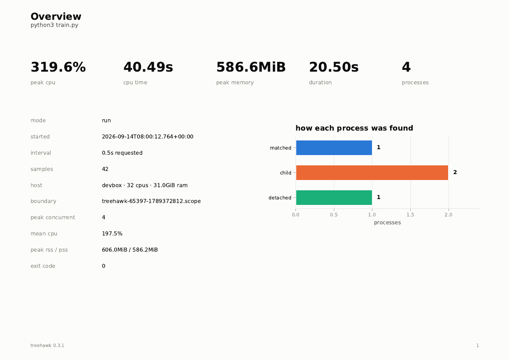
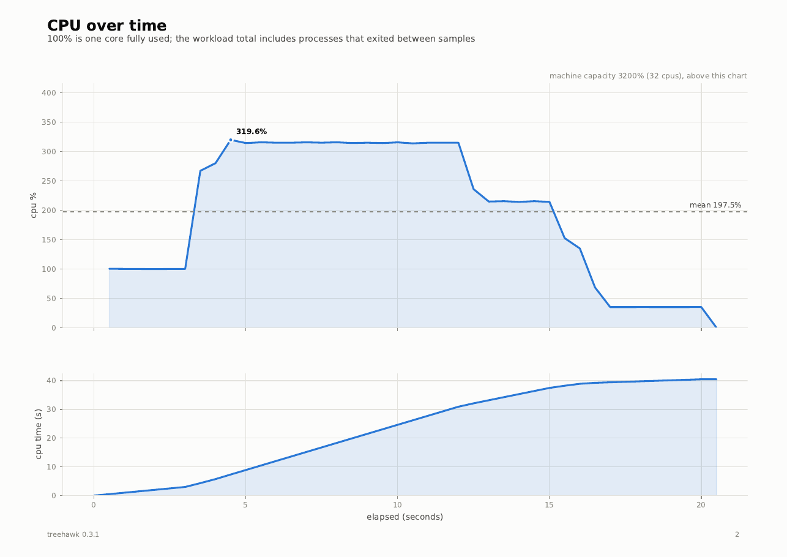
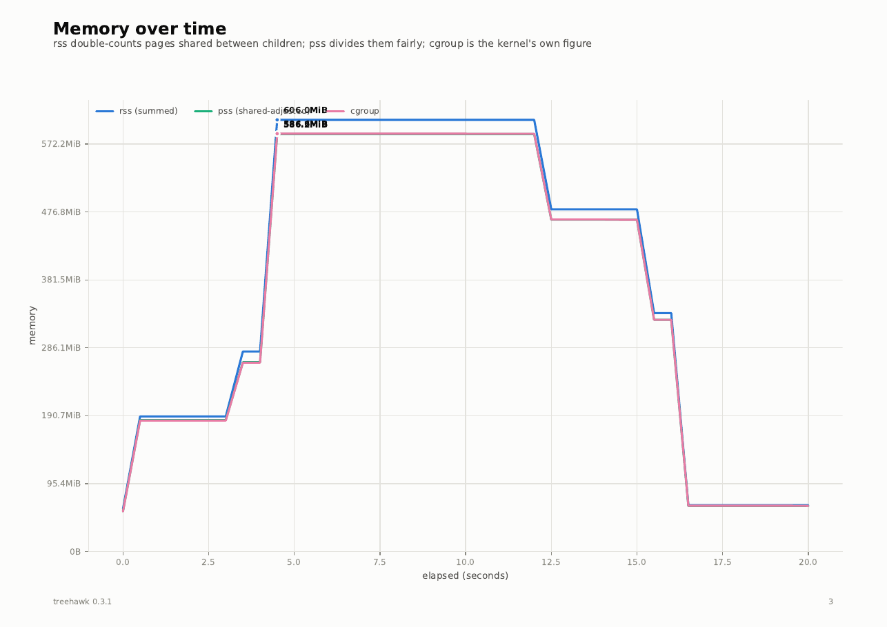
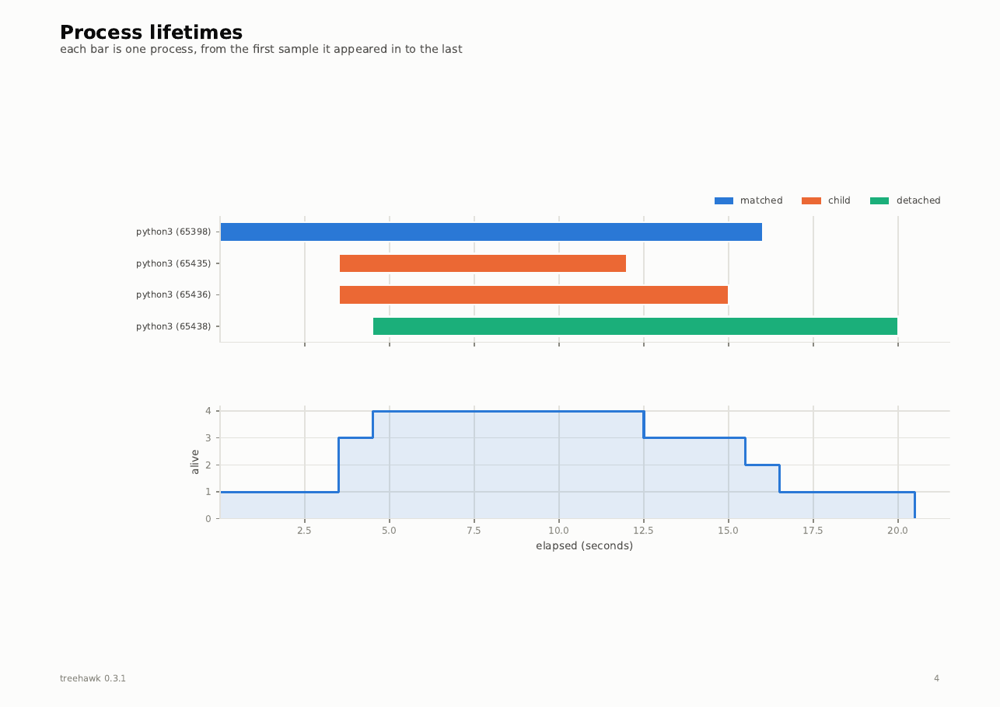
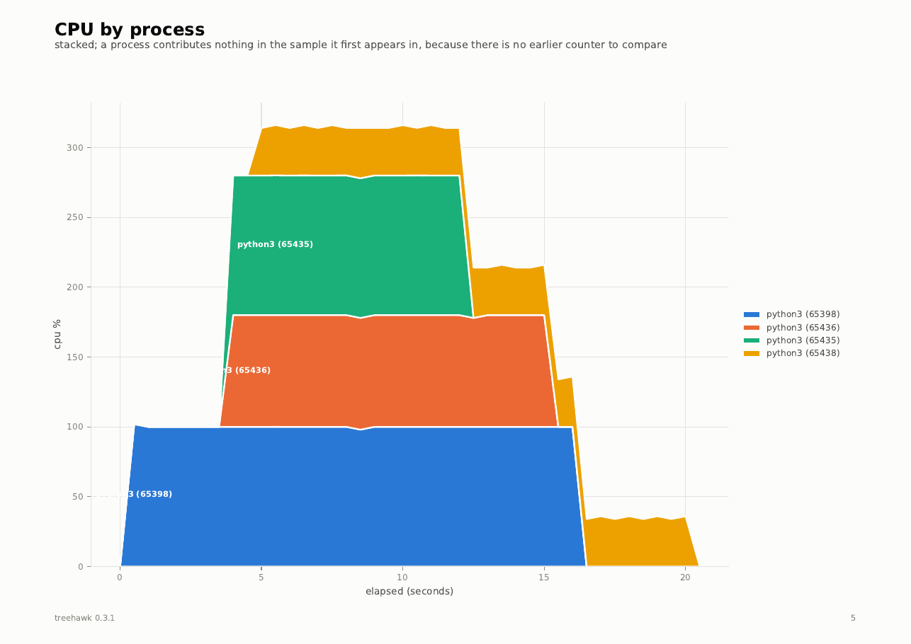
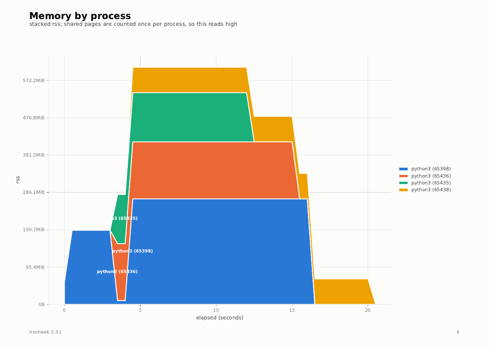
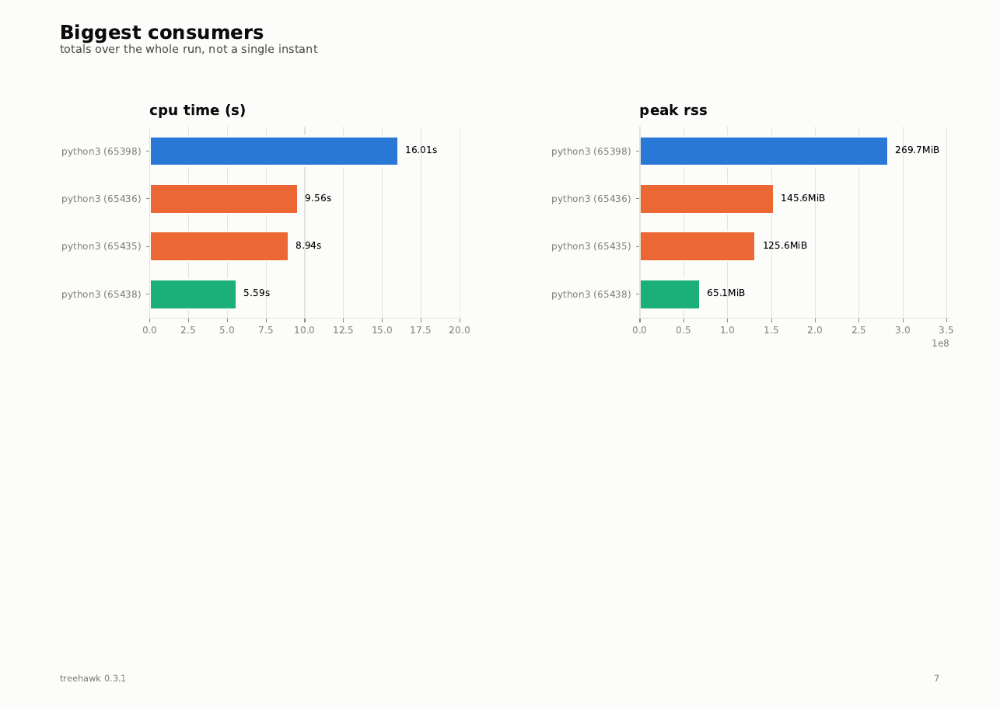
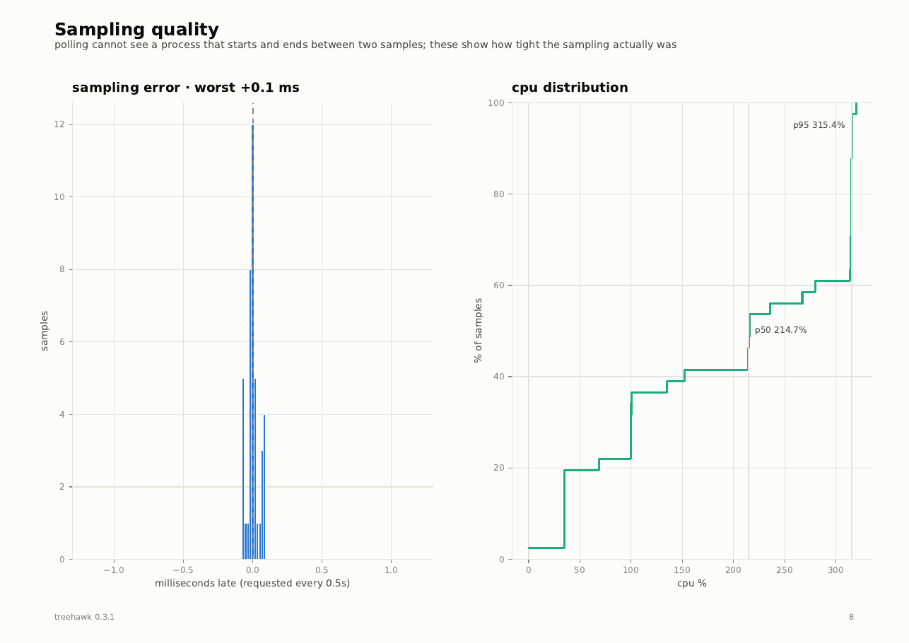

# The PDF report

`treehawk pdf` turns a finished log into a short PDF, one page per question about
the run.

```console
$ treehawk pdf train.jsonl
wrote train.pdf (8 pages)
$ treehawk pdf train.jsonl --output reports/train-2026-09-14.pdf
```

By default the PDF is written next to the log, with the same name. matplotlib is
imported only for this command, so recording never pays for it.

!!! example "See one"

    The pages below come from the [sample log](../assets/output/sample-run.jsonl):
    a training script with two data-loader workers and a metrics daemon that
    detaches. Download the [whole PDF](../assets/output/sample-run.pdf).

## The pages

<div class="th-gallery" markdown>

<figure class="page" markdown="span">
  [](../assets/output/pdf-page-1.png)
  <figcaption><strong>Overview</strong>: what happened, in five numbers, and how each process was found.</figcaption>
</figure>

<figure class="page" markdown="span">
  [](../assets/output/pdf-page-2.png)
  <figcaption><strong>CPU over time</strong>: was it busy, and did it stay busy? 100% is one core.</figcaption>
</figure>

<figure class="page" markdown="span">
  [](../assets/output/pdf-page-3.png)
  <figcaption><strong>Memory over time</strong>: RSS, PSS and the cgroup's own figure, together.</figcaption>
</figure>

<figure class="page" markdown="span">
  [](../assets/output/pdf-page-4.png)
  <figcaption><strong>Process lifetimes</strong>: who was alive, when; one bar per process.</figcaption>
</figure>

<figure class="page" markdown="span">
  [](../assets/output/pdf-page-5.png)
  <figcaption><strong>CPU by process</strong>: which process was burning the CPU.</figcaption>
</figure>

<figure class="page" markdown="span">
  [](../assets/output/pdf-page-6.png)
  <figcaption><strong>Memory by process</strong>: which process was holding the memory.</figcaption>
</figure>

<figure class="page" markdown="span">
  [](../assets/output/pdf-page-7.png)
  <figcaption><strong>Biggest consumers</strong>: the two league tables, totals over the whole run.</figcaption>
</figure>

<figure class="page" markdown="span">
  [](../assets/output/pdf-page-8.png)
  <figcaption><strong>Sampling quality</strong>: can you trust the other seven pages?</figcaption>
</figure>

</div>

## Reading the pages

**Colours mean the same thing on every page.** Processes are grouped by how they
were found: <span class="th-chip th-chip--matched"></span>matched,
<span class="th-chip th-chip--child"></span>child, and
<span class="th-chip th-chip--detached"></span>detached. The dashboard uses the
same three colours, so a process you saw live is easy to find afterwards.

**Stacked per-process CPU starts at zero.** A process contributes nothing in the
first sample it appears in, because there is no earlier counter to compare with.
The workload total on the *CPU over time* page does not have that gap under `run`,
where it comes from the cgroup.

**Stacked RSS reads high.** Summed RSS counts a shared page once per process. The
*Memory over time* page shows PSS and the cgroup figure beside it; see
[Memory numbers](../concepts/memory.md).

**Check the last page first when something looks odd.** *Sampling quality* shows
how regular the samples really were. Overruns, samples that took longer than the
interval, are counted there and marked on the CPU chart. A process that starts
and ends between two samples is invisible to polling, and this page is where a
too-long interval shows.

## Aggregate-only logs

A log written with `--aggregate-only` has no per-process rows, so the pages that
need them (*Process lifetimes*, the two stacked pages and *Biggest consumers*) are
left out rather than printed blank.

## An interrupted run

A log from a run that was killed has no summary line, and possibly a torn last
line. `treehawk pdf` still renders it: the torn line is skipped and the figures
are computed from the samples that were written.
