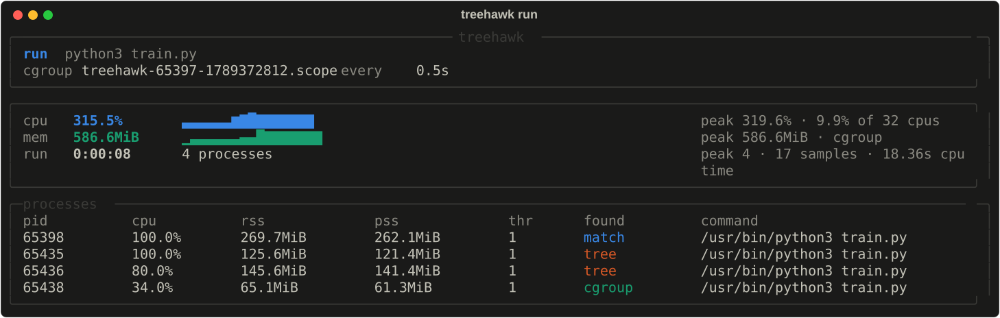

<div class="hero" markdown>


<h1>tree<span>hawk</span></h1>

Log the CPU and RAM a process uses, and every process it spawns,
**including children that daemonize and detach themselves**.

[Get started](#install){ .md-button .md-button--primary }
[How it works](how-it-works.md){ .md-button }

</div>

Point treehawk at something already running, or let it start the command. It
samples until the workload ends, then leaves a log you can summarise in the
terminal or turn into a PDF report.



## Why

Following parent-child links works until a child daemonizes: `fork`, `setsid`,
`fork` again, and the parent exits. The survivor is re-parented to the machine's reaper
(PID 1, `systemd --user`, or `launchd`), and a naive monitor reports the
workload finished while it is still burning a core. treehawk keeps it.


## Install

treehawk runs on Linux and macOS — including Apple Silicon — with Python 3.10
or newer. The two differ in what the kernel will total up for you; see
[Platforms](platforms.md).

```bash
curl -LsSf https://github.com/ibadrather/treehawk/releases/latest/download/install.sh | sh
```

The script needs no uv or pipx. It installs the latest release into its own
virtual environment, links `treehawk` into `~/.local/bin` and puts that on your
`PATH`. It uses any Python 3.10+ already present, or uv when there is none. Pin
a version with `| sh -s -- --version 0.4.0`. Or install it yourself:

```bash
uv tool install git+https://github.com/ibadrather/treehawk
```

## Quick tour

```bash
treehawk watch train.py                 # attach to a running process
treehawk run -- python train.py         # start a command; exact
treehawk report treehawk-*.jsonl        # summary in the terminal
treehawk pdf treehawk-*.jsonl           # an 8-page PDF report
```

Next: [Usage](usage.md) covers every command and option.
