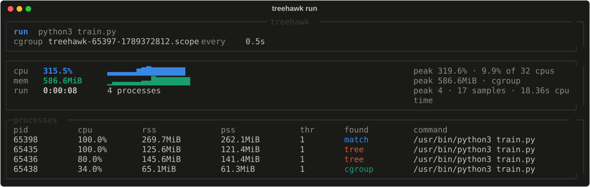

<div class="hero" markdown>


<h1>tree<span>hawk</span></h1>

Track the CPU and RAM usage of a process and every process it spawns,
**including children that daemonize and detach themselves**.

[Get started](#quick-tour){ .md-button .md-button--primary }
[How it works](how-it-works.md){ .md-button }

</div>

treehawk is a free, open-source resource usage monitor for the command line.
Point it at something already running, or let it start the command. It
samples until the workload ends, then leaves a log you can summarise in the
terminal or turn into a PDF report. It can also follow the busiest processes of
the whole machine, as a service from boot to shutdown.

It runs on Linux and macOS, including Apple Silicon, and reads the kernel
directly. The two platforms differ in what the kernel will total up for you: see
[Platforms](platforms.md).



## Why

Following parent-child links works until a child daemonizes: `fork`, `setsid`,
`fork` again, and the parent exits. The survivor is re-parented to the machine's reaper
(PID 1, `systemd --user`, or `launchd`), and a naive monitor reports the
workload finished while it is still burning a core. treehawk keeps it.


## Which command?

| You want to | Use |
|---|---|
| measure a command you are about to start | [`run`](workload.md#run-start-a-command) |
| measure something that is already running | [`watch`](workload.md#watch-attach-to-a-running-process) |
| follow the busiest processes of the whole machine, from boot if you like | [`top` and `service`](machine.md) |
| look at a finished log | [`report` and `pdf`](results.md) |

## Quick tour

```bash
curl -LsSf https://github.com/ibadrather/treehawk/releases/latest/download/install.sh | sh

treehawk run -- python train.py         # start a command and follow it; exact
treehawk watch train.py                 # attach to one that is already running
treehawk report treehawk-*.jsonl        # summary in the terminal
treehawk pdf treehawk-*.jsonl           # an 8-page PDF report
treehawk top                            # the top processes of the whole machine
```

[Install](install.md) has the installer's options and other ways to install.
Every command also explains itself with `--help`, and `treehawk --version`
prints the version.
