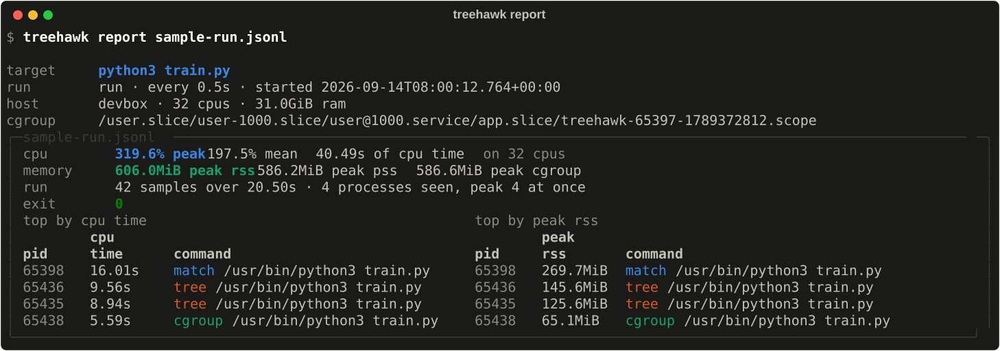
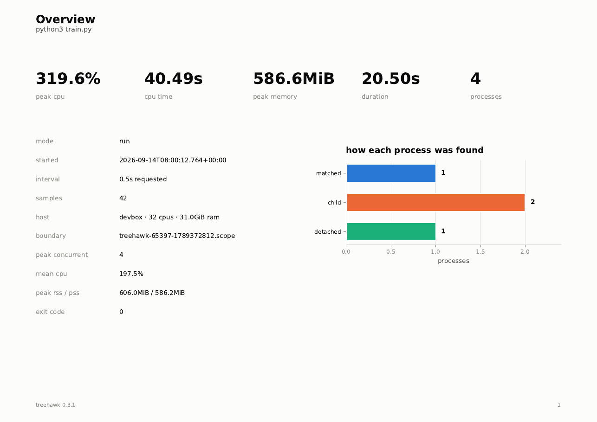
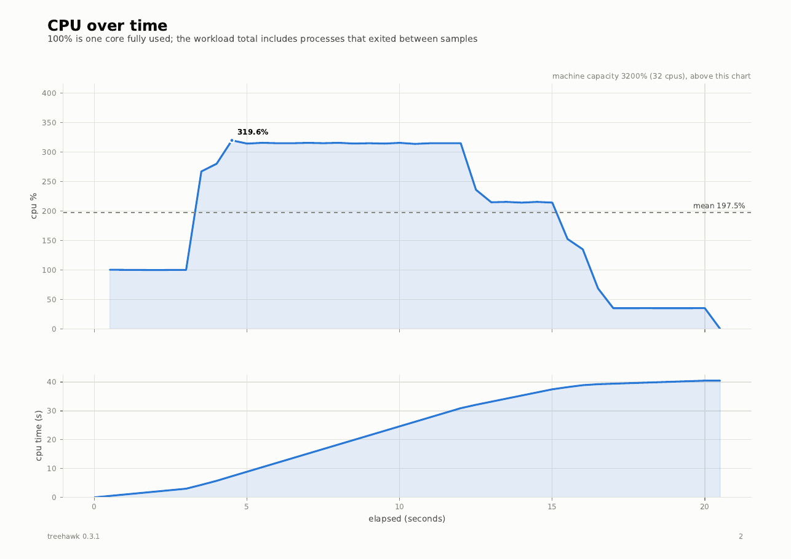
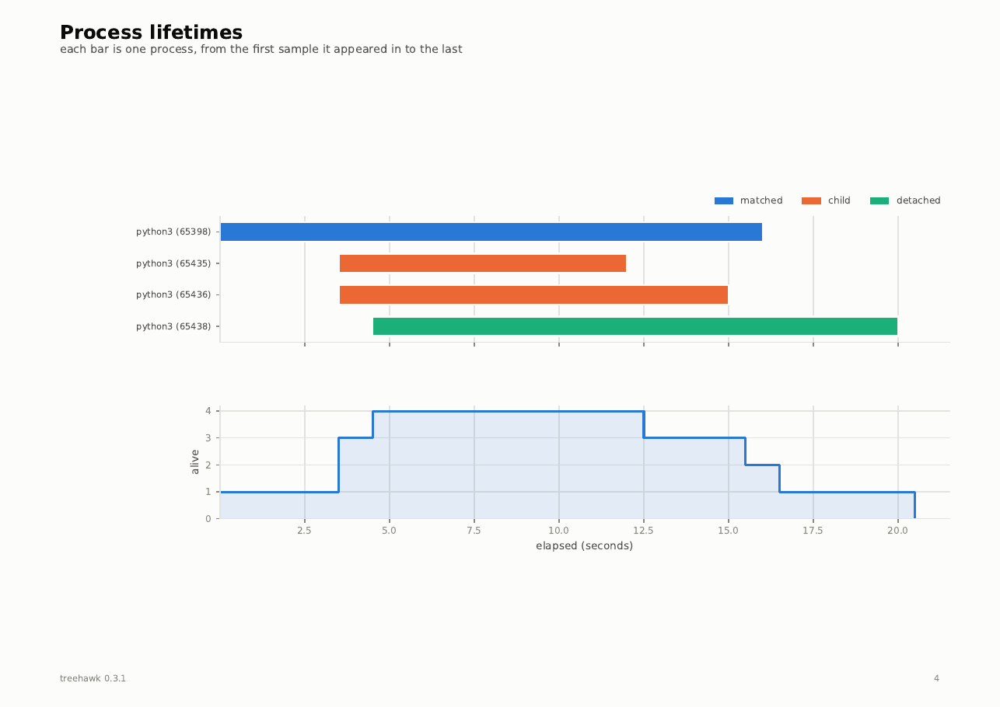

# Read the results

Every run leaves a log. `report` summarises it in the terminal, and `pdf` turns
it into a report. Both work on either kind of log (a `watch`/`run` log or a
`top` directory) and tell them apart by the log's header. They also work on the
log of an interrupted run, because the summary is recomputed from the samples
that were written.

```bash
treehawk report run.jsonl            # summary in the terminal
treehawk report run.jsonl --json     # header and summary as JSON
treehawk pdf run.jsonl               # writes run.pdf
treehawk report treehawk-top --since 2h
```



## report

| Option | |
|---|---|
| `PATH` | a log file, or for `top` a log directory, boot directory or single file |
| `--json` | print the summary as JSON instead of tables |
| `--since TIME` | `top` logs only: start here |
| `--until TIME` | `top` logs only: stop here |

`TIME` is either a moment (`"2026-09-27 14:00"`, ISO 8601, local time unless a
zone is given) or a span ago (`90`, `30m`, `2h`, `1d`).

## pdf

| Option | Default | |
|---|---|---|
| `PATH` | | as for `report` |
| `-o`, `--output PATH` | beside the log, as `.pdf` | where to write the PDF |
| `--since TIME`, `--until TIME` | | `top` logs only, as for `report` |

A workload log becomes eight pages, each answering one question.
[Download a sample report](assets/output/sample-run.pdf).

| Page | Question |
|---|---|
| Overview | What happened, in five numbers, and how each process was found |
| CPU over time | Was it busy, and did it stay busy? |
| Memory over time | How much, by each of the three measures |
| Process lifetimes | Who was alive, when: one bar per process |
| CPU by process | Which process was burning the CPU |
| Memory by process | Which process was holding the memory |
| Biggest consumers | The two league tables |
| Sampling quality | Can you trust the other seven pages? |

Pages that need per-process detail are left out of an `--aggregate-only` log
rather than printed blank.







A `top` log becomes five pages: machine overview; the whole machine's CPU and
memory, with spikes marked; CPU by process; memory by process; and spikes and
leak suspects. The charts keep the peak of each time bucket, so a spike still
shows in a month of data.

## The workload log

`watch` and `run` write JSON Lines by default: a `header` record, one `sample`
per interval, and a `summary` at the end. Each line is flushed as it is written,
so a killed run still leaves a readable log.

```jsonc
{"type":"header","mode":"run","argv":["python3","train.py"],"interval":0.5,
 "memory_kind":"pss","host":{"ncpu":32},"notes":[]}
{"type":"sample","seq":12,"t":6.0,"n_procs":4,
 "cpu_percent":315.5, "cpu_percent_norm":9.9, "cpu_seconds_total":18.4,
 "rss_bytes":642269184, "pss_bytes":614628352, "group_memory_bytes":615354368,
 "overrun":false,
 "procs":[{"pid":65438,"ppid":1,"name":"python3","cpu_percent":34.0,"rss_bytes":68263936,"via":"cgroup"}]}
{"type":"summary","samples":42,"duration_s":20.5,"peak_cpu_percent":319.64,"exit_code":0,
 "top_by_cpu":[...],"top_by_memory":[...]}
```

The fields you will reach for most:

| Field | |
|---|---|
| `memory_kind` | header: which fair measure `pss_bytes` carries, `pss` (Linux) or `phys_footprint` (macOS); a log without it is `pss` |
| `notes` | header: anything treehawk could not measure on this machine, and why |
| `cpu_percent` | CPU over the last interval, summed across processes; `100` is one core, `null` in the first sample |
| `cpu_percent_norm` | the same, as a share of the whole machine |
| `cpu_seconds_total` | lifetime CPU time, including exited children |
| `cpu_seconds_used` | CPU time since treehawk attached |
| `rss_bytes`, `pss_bytes`, `swap_bytes` | memory; see [which one to trust](how-it-works.md#memory) |
| `group_memory_bytes`, `group_memory_peak_bytes` | the kernel's own charge for the boundary; `null` without one, and always on macOS |
| `overrun` | this sample arrived more than 1.5 intervals late |
| `procs[].via` | which [membership rule](how-it-works.md#membership) found the process |

`null` always means the value could not be read; treehawk never writes a guess.
`--aggregate-only` drops `procs`.

A few `jq` recipes:

```bash
tail -n 1 run.jsonl | jq .                                               # the summary
jq -s 'map(select(.type == "sample")) | max_by(.cpu_percent) | {t, cpu_percent}' run.jsonl
jq -r 'select(.type == "sample") | [.t, .cpu_percent, .pss_bytes] | @csv' run.jsonl
```

### CSV

`--csv` writes four files instead of one:

| File | |
|---|---|
| `run.csv` | one row per sample |
| `run.procs.csv` | one row per process per sample, joined to `run.csv` on `seq`; not written with `--aggregate-only` |
| `run.header.json` | the header |
| `run.summary.json` | the summary |

### What the workload printed

`run` keeps the command's stdout and stderr, together and in order, in
`<log>.out`, so `run.jsonl` is accompanied by `run.out`. It is the raw stream,
escape codes included:

```bash
less -R run.out                # with the colours
grep -n "Traceback" run.out    # what went wrong, next to what it cost
```

Only `run` writes it, and only when it captured the output (see [What the
command prints](workload.md#what-the-command-prints)). `watch` never does,
because the process was already running and its output was never treehawk's to
read.

## The top log

`top` writes a directory of segments, one directory per boot:

```
treehawk-top/<boot>/top-20260927-140000.jsonl      the segment being written
treehawk-top/<boot>/top-20260927-130000.jsonl.gz   a closed one, compressed
```

Each segment is complete on its own: it opens with a `header`, ends with a
`summary`, and in between holds:

| Record | |
|---|---|
| `proc` | who a process is (`pid`, `starttime`, `name`, `cmdline`), written the first time a segment mentions it |
| `sample` | the machine line (`host`: `cpu_percent`, `mem_used_bytes`, `mem_available_bytes`, `swap_used_bytes`) plus a compact row per top-N process in `top` |
| `event` | `enter` or `leave` the top N, `spike`, or `creep`, with the `value`, `baseline` or `slope_per_hour` that triggered it |

Each row in `top` is a list in the order the header's `row_fields` names:
`pid`, `starttime`, `cpu_percent`, `rss_bytes`, `pss_bytes`, `swap_bytes`,
`reasons`. `reasons` says why the process is there: `c` for
CPU, `m` for memory, or `cm` for both. Because a command line is written once
per segment and not in every row, a log can run for the lifetime of a machine.
