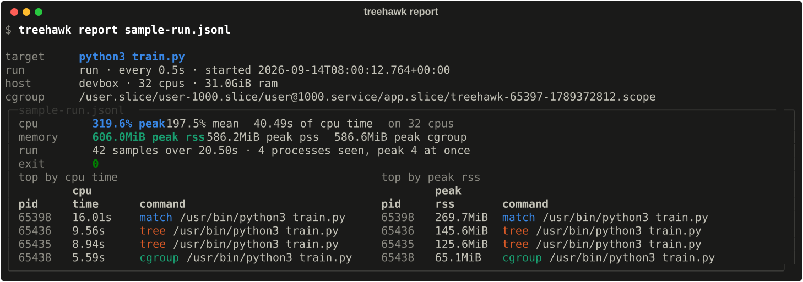

# Usage

treehawk has four commands: `watch` and `run` record a workload, `report` and
`pdf` read a finished log back. Every command explains itself with `--help`.

## watch: attach to a running process

```bash
treehawk watch train.py                      # substring of the command line
treehawk watch --exact "python train.py"     # the whole command line
treehawk watch --regex 'worker-\d+'          # a regular expression
treehawk watch --pid 4213                    # one process id
```

Give exactly one of them. Keyword and regex matches are case-insensitive, and
every matching process joins the workload. treehawk never matches itself or the
shell you typed the command in.

If nothing matches, `watch` exits with code `2`. Add `--wait` to keep looking
until the process appears.

A watch ends when the workload's last process exits, when `--duration` has
passed, or on `Ctrl-C` / `SIGTERM`. The log always ends with a summary, and the
workload is left running.

## run: start a command

```bash
treehawk run -- python train.py --epochs 10
```

The command goes after `--`. treehawk starts it in a transient systemd scope, a
cgroup of its own, so every descendant is counted by the kernel, including
processes that live and die between two samples.

- Without systemd or cgroup v2 (common in containers and CI), treehawk falls back
  to tracking through `/proc` and records why in the log header's `notes`.
  `--no-isolate` chooses that mode on purpose.
- `Ctrl-C` and `SIGTERM` are forwarded to the command.
- If the command fails, `treehawk run` exits with its status.

See [How it works](how-it-works.md#run-and-watch) for how `run` and `watch` differ.

## Options

Shared by `watch` and `run`:

| Option | Default | |
|---|---|---|
| `-i`, `--interval SECONDS` | `1.0` | time between samples |
| `-o`, `--output PATH` | `treehawk-<timestamp>.jsonl` | the log; `-` writes to stdout |
| `--csv` | | write CSV instead of JSON Lines |
| `-q`, `--quiet` | | no dashboard, just the log |
| `-d`, `--duration SECONDS` | | stop early |
| `--expand RULE` | all four | limit the membership rules; repeat for several |
| `--no-pss` | | skip PSS; cheaper at short intervals |
| `--aggregate-only` | | log workload totals only, not a row per process |

Without a terminal (a pipe, CI), the dashboard is replaced by plain lines.

## report and pdf

```bash
treehawk report run.jsonl          # summary in the terminal
treehawk report run.jsonl --json   # the header and summary as JSON
treehawk pdf run.jsonl             # writes run.pdf; -o to choose
```



Both work on the log of an interrupted run: the summary is recomputed from the
samples that were written.

## Exit codes

| Code | Meaning |
|---|---|
| `0` | finished, or stopped with `Ctrl-C` / `SIGTERM` |
| `1` | invalid option, unreadable log, or a command that could not start |
| `2` | no process matched, or a usage error |
| other | `run`: the command's exit status |

## In CI

Fail a job when a test suite uses too much memory:

```bash
treehawk run --quiet -o pytest.jsonl -- uv run pytest
treehawk report pytest.jsonl --json | jq -e '.summary.peak_pss_bytes < 2 * 1024 * 1024 * 1024'
```
